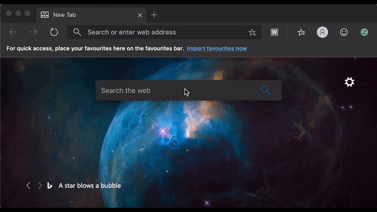

Web project / test assistant
===========================

This extension is meant to help surfacing your versionning in a way that end users (in particular testers) can pick up easily.

Depending on how much flexibility you have, the approach is therefore to ensure that as many details are available in the development environments, and then just a version number in the onwards environments (, up to no version in Production).

> This was tested on Chrome and Edge, on Windows and MacOS.

> Do not forget to set your project to surface the version. Usually leveraging the [Replace Tokens](https://marketplace.visualstudio.com/items?itemName=qetza.replacetokens) extension in Azure DevOps and replacing the related tokens.

## 1. Download the latest version of the extension

Either clone or download the master branch, and select the folder "webproject-assistant-chrome-extension".

## 2. Install the extension

> Follow the instructions from the the dev website [https://developer.chrome.com/extensions/getstarted](https://developer.chrome.com/extensions/getstarted)

In your browser (Chrome or Edge):
- go to [chrome://extensions](chrome://extensions)
- switch on __Developer Mode__
- select load unpack, and select the folder to which you unzipped earlier

The extension will then show up with icon "A".

## 3. Use it to track deployed versions and their related changes

You can now use it to track deployed versions and their related changes, _and don't forget to also reference that build version when raising your defects_.

----
[Back to root](/readme.md)

